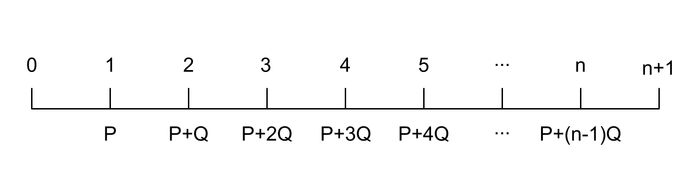

```{r setup, include=FALSE}
knitr::opts_chunk$set(echo = FALSE)
```

## Section 2.3 : Annuités avec paiements variables

Dans cette section, il y 2 principales manières de procéder :

* Soit on apprend les formules
* Soit on essaye de se débrouiller avec les séries géométriques

## Les annuités en progression arithmétique croissante

Nous nous concentrons d'abord sur les annuités croissantes : 

$$
\Ia{\angln i} = \frac{\ax**{\angln i} - nv^n}{i}
$$
$$
\Is{\angln i} = (1+i)^n \times \Ia{\angln i} = \frac{\sx**{\angln i} - n}{i}
$$

---

Il existe aussi des formules pour les annuités décroissantes : 

$$
\Da{\angln i} = \frac{n - \ax{\angln i}}{i}
$$
$$
\Ds{\angln i} = (1+i)^n \times \Da{\angln i} = \frac{n(1+i)^n - \sx{\angln i}}{i}
$$

---

Une autre formule utile est la formule P&Q. L'annuité étudiée doit avoir la forme présentée dans la figure ci-dessous. 

$$
VP_{@0} = P\ax{\angln i } + Q \times \frac {\ax{\angln i} - nv^n}{i}
$$



---

## Les annuités continues avec paiements variables

La valeur actualiseé d’une annuité continue avec fonction de paiement g(x) payable sur [t,t +h] est quant à elle donnée par 

$$
VP_{@0}= \int_t^{t+h} g(x) \times \mathrm{e}^{-\int_t^{x}\delta(u)\mathrm{du}}\mathrm{dx}
$$

## Section 2.4

Il existe 3 types de taux : 

* Taux d’intérêt consenti pour le prêt
* Taux de réinvestissement
* Taux de rendement
